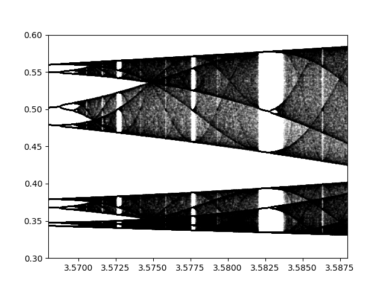

# Logistic Map Bifurcation Diagram

After the reading of 'Chaos: Making a New Science' by James Gleick I've tried to reproduce the bifurcation diagram of the Logistic Map. This equation shows how chaos can happen from very simple rules. The result will be something looking like this :

## Logistic Map

We observe the convergence on one or multiple value of the logistic map, which is defined as follow :

x_[n+1] = r * x_n * (1-x_n)

We will change the parameter r to observe the values on which the series converges.

We can observe phase transition, but all of this (and much more) is explained on the [Wikipedia page](https://en.wikipedia.org/wiki/Logistic_map).

## The code

There are several parameters you can play with :

- `start` is the starting value of x for every simulation. It does not affect much the results
- `nb_epochs` is the number of epochs for every simulation
- `nb_last` represents how many of the last values will be used for computing the final values of the series
- `number_of_steps` is the number of simulations that will be computed for the final graph. The higher it is the better will be the quality of the graph (and the longer it will take)
- `xmin` and `xmax` are the limits of the x axis you want to see
- `y_limits` is the limit of the y axis of the graph. It can be let to 'default' or given a list : [ymin,ymax]
- `with_lines` is a boolean for whether or not you want to plot lines on the phase transitions
- `save` is a boolean indicating if you want to save the figures or not

## Some results

